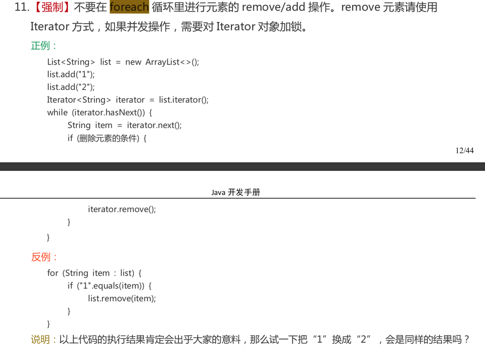

[TOC]

# 浮点运算
浮点数之间的比较判断，因为存在**精度丢失**问题，所以要使用**BigDecimal**进行处理。

# 不要在 foreach 循环里进行元素的 remove/add 操作


# 泛型的实际应用

## 实现最小值函数

自己设计一个泛型的获取数组最小值的函数.并且这个方法只能接受Number的子类并且实现了Comparable接口。

```java
//注意：Number并没有实现Comparable
private static <T extends Number & Comparable<? super T>> T min(T[] values) {
    if (values == null || values.length == 0) return null;
    T min = values[0];
    for (int i = 1; i < values.length; i++) {
        if (min.compareTo(values[i]) > 0) min = values[i];
    }
    return min;
}
```

测试：

```java
int minInteger = min(new Integer[]{1, 2, 3});//result:1
double minDouble = min(new Double[]{1.2, 2.2, -1d});//result:-1d
String typeError = min(new String[]{"1","3"});//报错
```